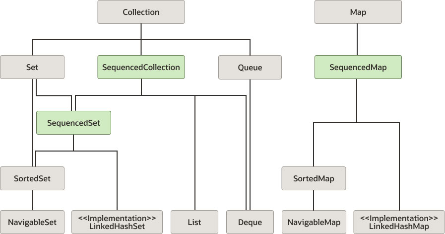

1) What is collection?  
  i) A collection is an object that represents a group of objects.  
  Ii) <b> Unmodifiable collection: <b>  
    a) A collection is considered unmodifiable if elements cannot be added, removed, or replaced. After you create an unmodifiable instance of a collection, it holds the same data as long as a reference to it exists.   
    b) Any attempt to add, set, or remove elements from unmodifiable collections(view) causes an UnsupportedOperationException to be thrown.  
    c) However, if the contained elements are mutable, then this may cause the collection to behave inconsistently or make its contents to appear to change.  
    d) Space efficiency  :
      d1) Unmodifiable collection instances generally consume much less memory than modifiable collection instances that contain the same data.  
      d2) These collections internally has private classes hidden behind a static factory method. When it is called, the static factory method chooses the implementation class based on the size of the collection. 
      d3) please see memory usage in below two examples  
          ex1:     
          Set<String> set = new HashSet<>(3);   // 3 buckets  
          set.add("silly");  
          set.add("string");  
          set = Collections.unmodifiableSet(set);  
          hashset internally implemented using hashmap of two nodes.   
          threee objects in a set. so 6 objects. 12*6= 96  
          two strings, set reference, unmodifiable set wrapped set.so total 28*2 = 56  
          total 152 bytes  
          ex2:  
          Set<String> set = Set.of("silly", "string");  
          one object and two fields. so overhead is 20 bytes only.  

  iii) <b> Modifiable collection: <b>   
   a) A collection that is modifiable must maintain bookkeeping data to support future modifications. This adds overhead to the data that is stored in the modifiable collection. A collection that is unmodifiable does not need this extra bookkeeping data.  

  iv) <b> Thread Safety: <b>  
   a) A collection is considered unmodifiable if elements cannot be added, removed, or replaced. However, an unmodifiable collection is only immutable if the elements contained in the collection are immutable. To be considered thread safe, collections created using the static factory methods and toUnmodifiable- collectors must contain only immutable elements.  

  v) <b> Sequenced Collection: <b>  
   a) Please refer   
   b) Methods added to the Collections utility class create unmodifiable wrappers for three types:  
   Collections.unmodifiableSequencedCollection(sequencedCollection)  
   c) A SequencedCollection supports common operations at either end, and it supports processing the elements from first to last and from last to first (such as, forward and reverse).  

2) How will we iterate over a collection?   
   Enhanced for loops, Explicit iterator() loops, forEach(), stream(), parallelStream(), toArray()  
   