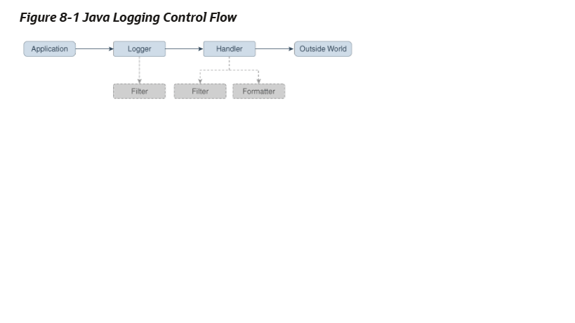

1) Logger objects are organized in a hierarchical namespace and child Logger objects may inherit some logging properties from their parents in the namespace.  
2) These Logger objects allocate LogRecord objects which are passed to Handler objects for publication. Both Logger and Handler objects may use logging Level objects and (optionally) Filter objects to decide if they are interested in a particular LogRecord object. When it is necessary to publish a LogRecord object externally, a Handler object can (optionally) use a Formatter object to localize and format the message before publishing it to an I/O stream.  
3) Please check the below strucutured flow.   Filter, Formater, Handler can be one or more in this flow as per the need.  
 Please refer   
4) Handlers  
  Java SE provides the following Handler classes:  
    a) StreamHandler: A simple handler for writing formatted records to an OutputStream.  
    b) ConsoleHandler: A simple handler for writing formatted records to System.err.  
    c) FileHandler: A handler that writes formatted log records either to a single file, or to a set of rotating log files.  
    d) SocketHandler: A handler that writes formatted log records to remote TCP ports.  
    e) MemoryHandler: A handler that buffers log records in memory.  
5) Default Configuration  
    The default logging configuration that ships with the JDK is only a default and can be overridden by ISVs, system administrators, and end users. This file is located at java-home/conf/logging.properties. 
6) Unique Message IDs  
    The Java Logging APIs do not provide any direct support for unique message IDs. Those applications or subsystems requiring unique message IDs should define their own conventions and include the unique IDs in the message strings as appropriate.  
7) Sample usage  
   java.util.logging package.  

   package com.wombat;  
    import java.util.logging.*;  

    public class Nose {  
    // Obtain a suitable logger.  
    private static Logger logger = Logger.getLogger("com.wombat.nose");  
    public static void main(String argv[]) {  
        // Log a FINE tracing message  
        logger.fine("doing stuff");  
        try {  
            Wombat.sneeze();  
        } catch (Exception ex) {  
            // Log the exception  
            logger.log(Level.WARNING, "trouble sneezing", ex);  
        }  
        logger.fine("done");  
    }  
    }  

    Changing file configuraiton  
    public static void main(String[] args) {  
    Handler fh = new FileHandler("%t/wombat.log");  
    Logger.getLogger("").addHandler(fh);  
    Logger.getLogger("com.wombat").setLevel(Level.FINEST);  
    ...  
    }  
